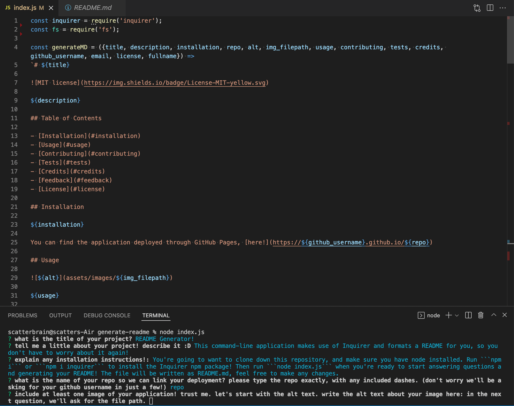

# README Generator


This charming and friendly command-line application makes use of Inquirer npm to format a spanking README. Fear not the details of a README again.

## Table of Contents

- [Installation](#installation)
- [Usage](#usage)
- [Credits](#credits)
- [Feedback](#feedback)
- [License](#license)

## Installation

Start by cloning the repository. Next, make sure you have Node.js installed. Run ```npm i``` or ```npm i inquirer``` in Terminal to install Inquirer. Then, run ```node index.js``` when you're ready to start answering questions and generating your README. The file will be written as README.md, feel free to make any changes.

## Usage



This image is what it should look like in Terminal after running ```node index.js```. A series of questions will be prompted to process the details of your application that will ultimately be included in the README.

The README.md will include: TITLE, DESCRIPTION, TABLE OF CONTENTS, INSTALLATION, USAGE, CONTRIBUTING, TESTS, CREDITS, FEEDBACK, LICENSE.

Take a look at this [video](https://watch.screencastify.com/v/FmYaacpQMsiHyfuadMBz) for further insight on how the app runs.

## Credits

[Inquirer npm package](https://www.npmjs.com/package/inquirer)

[Node.js](https://nodejs.org/en/)

[Shields.io](https://shields.io/)

## Feedback

Any questions, feedback, or issues, please feel free to connect with me on [github](https://github.com/middlenamestar) or by email: priscillama621@gmail.com =^.^=

## License

Copyright (c) 2022 stardust productions.

Licensed under the MIT license.