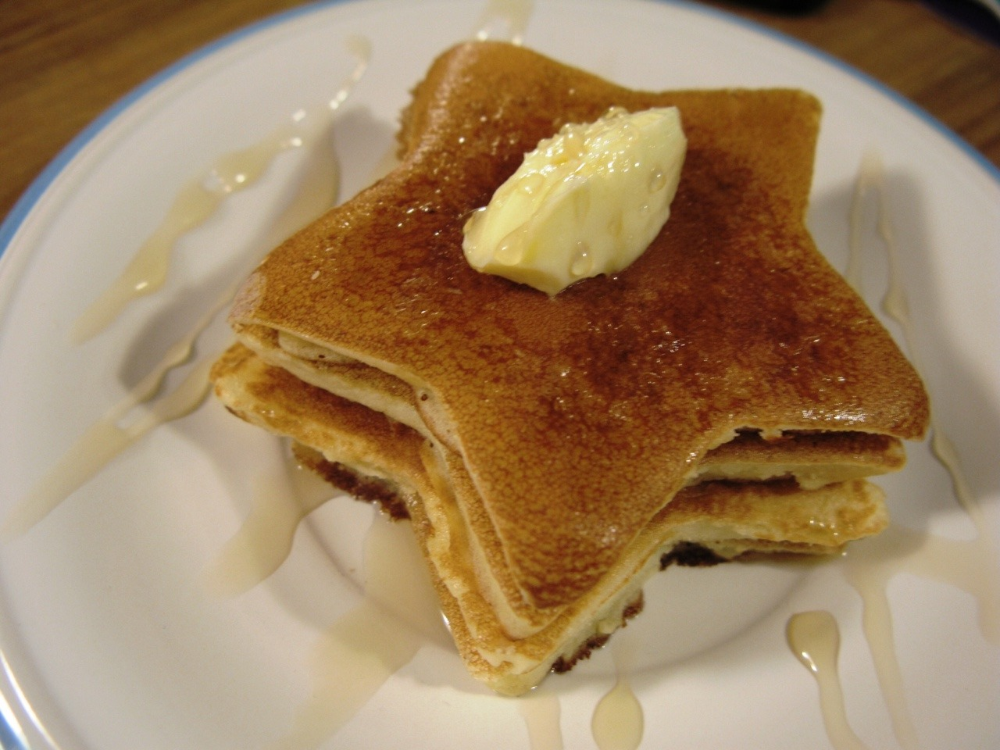

# Fairy Butterflies

Butterflies and zebras, and moonbeams, and fairytales. That's all she ever thinks about.

## Table of Contents

- [Installation](#installation)
- [Usage](#usage)
- [Contributing](#contributing)
- [Tests](#tests)
- [Credits](#credits)
- [Feedback](#feedback)
- [License](#license)

## Installation

This command-line application will require node, for you to run npm init, and install Inquirer by running npm i inquirer. If the application were deployed, the link would be found in the next line.

You can find the application deployed through GitHub Pages, [here!](https://middlenamestar.github.io/FAKEREPO)

## Usage

Look at the pancake! Answer some questions in node.

## Contributing

Contribute any way you want, community is everything :)

## Tests

Test test test testing! How to test 1. Blank 2. Blank 3. Blank

## Credits

Credits rolling. Credit tumblr for the pancake photo!

## Feedback

Any questions, feedback, or issues, please feel free to connect with me on [github](https://github.com/middlenamestar) or by email: priscillama621@gmail.com =^.^=

## License

MIT License

Copyright (c) 2022 stardust productions.

Permission is hereby granted, free of charge, to any person obtaining a copy
of this software and associated documentation files (the "Software"), to deal
in the Software without restriction, including without limitation the rights
to use, copy, modify, merge, publish, distribute, sublicense, and/or sell
copies of the Software, and to permit persons to whom the Software is
furnished to do so, subject to the following conditions:

The above copyright notice and this permission notice shall be included in all
copies or substantial portions of the Software.

THE SOFTWARE IS PROVIDED "AS IS", WITHOUT WARRANTY OF ANY KIND, EXPRESS OR
IMPLIED, INCLUDING BUT NOT LIMITED TO THE WARRANTIES OF MERCHANTABILITY,
FITNESS FOR A PARTICULAR PURPOSE AND NONINFRINGEMENT. IN NO EVENT SHALL THE
AUTHORS OR COPYRIGHT HOLDERS BE LIABLE FOR ANY CLAIM, DAMAGES OR OTHER
LIABILITY, WHETHER IN AN ACTION OF CONTRACT, TORT OR OTHERWISE, ARISING FROM,
OUT OF OR IN CONNECTION WITH THE SOFTWARE OR THE USE OR OTHER DEALINGS IN THE
SOFTWARE.