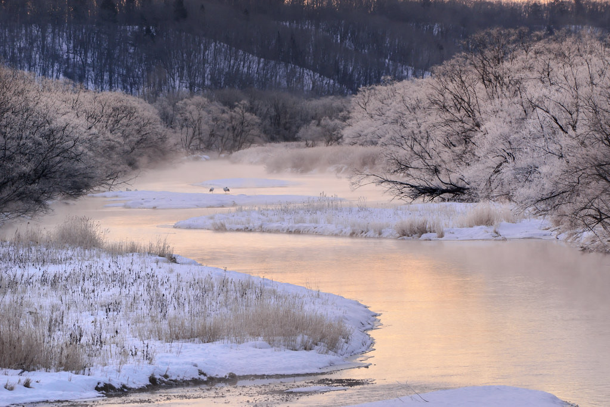

# title

description

## Table of Contents

- [Installation](#installation)
- [Usage](#usage)
- [Contributing](#contributing)
- [Tests](#tests)
- [Credits](#credits)
- [Feedback](#feedback)
- [License](#license)

## Installation

installation instructions

You can find the application deployed through GitHub Pages, [here!](https://middlenamestar.github.io/repo)

## Usage

usage, how to

## Contributing

contribution

## Tests

testing

## Credits

credits

## Feedback

Any questions, feedback, or issues, please feel free to connect with me on [github](https://github.com/middlenamestar) or by email: priscillama621@gmail.com =^.^=

## License

Copyright (c) 2022 priscilla ma

Licensed under the MIT license.